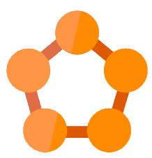

#   Azure Service Fabric Knowledge Base

A curated list of helpful material to start learning Modern Development Things :smile:

Project Workflow using [ZenHub](https://www.zenhub.com/) 

Title | Author | Version | Group | Sub-Levels
--- | --- | --- | --- | ---
*Azure Service Fabric Knowledge base* | dtro-devuk | 1.0 | Root | **0**

Azure Service Fabric is a Platform-as-a-Service offering, which promises us a way to build highly reliable, massively scalable cloud based services

* Service Fabric comes in different flavours catering to different requirements. 
* There are two APIs available to us, 
1. Reliable Actors and 
2. Reliable Service(s) API's, 
* and the services we build can be either **stateful** or **stateless**.

### Intro

* [Martin Fowler - MicroServices](https://martinfowler.com/articles/microservices.html)

#### Official

* [Azure Service Fabric - Building MicroServices](https://azure.microsoft.com/en-in/services/service-fabric/)
* [Overview of Azure Service Fabric](https://docs.microsoft.com/en-us/azure/service-fabric/service-fabric-overview)
* [Cloud Design Patterns](https://msdn.microsoft.com/en-us/library/dn568099.aspx)

#### Others
* [Microservices based application on the Azure compute platform](https://articles.microservices.com/microservices-based-application-on-the-azure-compute-platform-ea6b12c28782#.r4zirxhxf)
* [Service Fabric Customer Profile: TalkTalk TV](https://blogs.msdn.microsoft.com/azureservicefabric/2016/03/15/service-fabric-customer-profile-talktalk-tv/)

##### Actor Frameworks, Patterns etc
* [Service Fabric Reliable Actors](https://docs.microsoft.com/en-us/azure/service-fabric/service-fabric-reliable-actors-introduction)

#### Actor Model
* [The Actor Model in 10 minutes(see the video, Hewitt, Meijer & Szyperski)](http://www.brianstorti.com/the-actor-model/)
* [What is definition](http://whatis.techtarget.com/definition/Azure-Service-Fabric)
* [A Practical Overview of Actors](https://alexandrebrisebois.wordpress.com/2016/07/09/a-practical-overview-of-actors-in-service-fabric/)
* [Getting to know actors](https://alexandrebrisebois.wordpress.com/2016/07/25/getting-to-know-actors-in-service-fabric/)

## Swagger
* [Swagger for Azure Service Fabric Stateless Web API application](http://stackoverflow.com/questions/40088573/swagger-for-azure-service-fabric-stateless-web-api-application)

### Tutorials

#### Official
* [Create your first Service Fabric App](https://docs.microsoft.com/en-us/azure/service-fabric/service-fabric-create-your-first-application-in-visual-studio)
* [Get started with deploying and upgrading applications on your local cluster](https://docs.microsoft.com/en-us/azure/service-fabric/service-fabric-get-started-with-a-local-cluster)
* [Sheepisly Startup app](https://blog.geist.no/azure-service-fabric-introduction-getting-it-running/)

#### Completed
* [Completed Voting Service](https://github.com/toddabel/Service-Fabric-Labs/tree/master/Lab%202/src)

### Official Sample Apps
* [Service Fabric Getting Started Samples](https://azure.microsoft.com/en-gb/resources/samples/service-fabric-dotnet-getting-started/)
* [Azure Samples](https://github.com/Azure-Samples)
* [WordCount WebService](https://github.com/Azure-Samples/service-fabric-dotnet-getting-started/tree/master/Services/WordCount/WordCount.WebService)

### Azure Symbols
* [Microsoft has Released a Set of Symbols/Icons to Visually Represent Azure Solutions](https://alexandrebrisebois.wordpress.com/2014/02/19/microsoft-has-released-a-set-of-symbolsicons-to-visually-represent-windows-azure-solutions/)